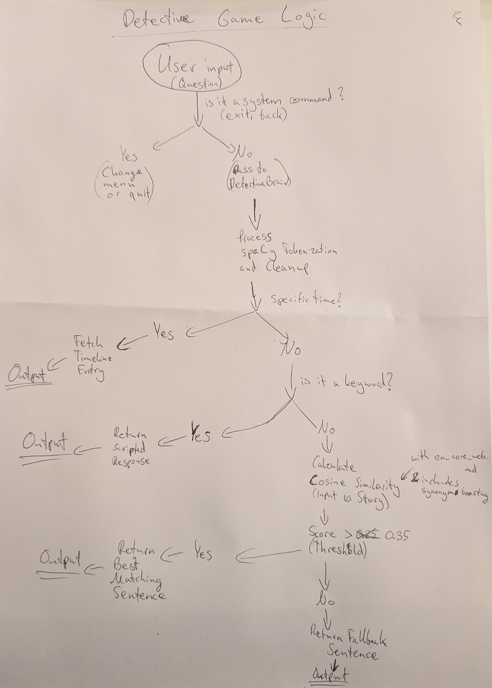

# 📂 Project Documentation

## 1. Project Concept & Ideas
My initial idea was to gamify the chatbot experience. Instead of a standard Q&A bot, I wanted to create a non-linear narrative where the user acts as a detective in a murder mystery and asks questions to different bots (suspects) to find out who the killer is. 

**The Core Idea:**
"The Detective Game" is a twist on the board game *Cluedo*. My goal was to use NLP to bridge the gap of understanding the *intent* rather than just the words.

**The Evolution (Infinite Mysteries):**
While the initial concept relied on hardcoded stories, I realized that once a case is solved, the game has no replay value. I expanded the concept to become an **"Infinite Mystery Engine."** I integrated Generative AI (Google Gemini) to act as the "Writer," creating unique scenarios, suspects, and clues on the fly, while the local NLP engine acts as the "Brain" to handle the gameplay.

## 2. Development Process
I first chose a modular hardcoded architecture to separate the story data from the logic processing.
Which I later on changed into a dynamic but still modular structure.

* **Phase 1: The Data Structure:** I started by writing the backstories. I created a `Suspect` class to hold not just the name and basic information, but a dictionary of "Knowledge" and a "Timeline." This allowed me to map specific times (e.g., "19:00") to specific alibis.
* **Phase 2: The Logic (spaCy):** I implemented `en_core_web_md` because I needed vector similarity. I wrote a script to compare the user's input vector against the suspect's known sentences.
* **Phase 3: The Generative AI Integration:** To achieve the "infinite" aspect, I utilized the Google Gemini API. This involved significant **Prompt Engineering** to ensure the AI outputted strict, code-compliant JSON that my existing Python classes could parse without crashing.
* **Phase 4: The UI:** I added the `Rich` library directly in the beginning (which was probably not helpful - and I won't do it again like this but that happens..), but I changed it now at the end again because it didn't look nicely done. The panels and colors help the user distinguish between the "Narrator" and the "Suspects." And it feels more game like now.

## 3. Reflection & Challenges
* **Challenge:** Handling "Who" questions. Initially, asking "Who killed him?" would trigger defensive responses because the model detected the word "kill" (which is usually an accusation). And generally it was a lot of work to implement the NLU part nicely.
* **Solution:** I added logic to detect interrogative pronouns. If the user asks "Who", the bot knows it is an inquiry, not an accusation. Integrating the cosine similarity score helped to make the computer understand better what was actually asked (NLU).

* **Challenge:** It was difficult to write enough content to cover every possible user question, without the bot being confused or answering in the wrong context.
* **Solution:** I implemented a "Fallback" system and a "Keyword Boost." If the vector score is low, but a specific keyword (like "money") is present, the system forces a relevant response.

* **Challenge:** At the end, after having integrated the Google API to generate storylines, I had a hard time making it structurally better and making the user experience nicer. At first, you had to use the `generate_story.py` separately to generate a story and then start `main.py`.
* **Solution:** I renamed the `generator.py` (formerly `generate_story.py`) and put it into the `src` folder, since it should be used in `main.py` in one full Game-Flow. I then fixed the code in `main.py` to allow the user to choose between playing an existing file or generating a new one directly from the start menu.

## 4. References
* **spaCy Documentation:** https://spacy.io/usage/vectors-similarity (Used for the cosine similarity logic - NLU Intent Analysis).
* **Google AI Studio:** https://aistudio.google.com/ (Used for API integration).
* **Rich Library:** https://rich.readthedocs.io/ (Used for terminal UI).
* **Course Materials**

## 5. Sketches

Game Logic